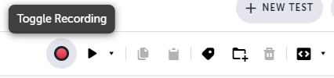
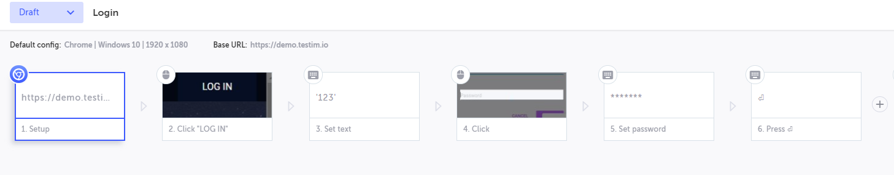
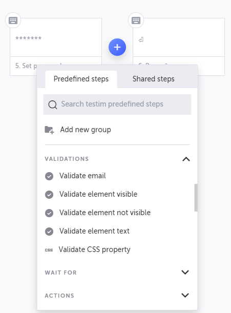
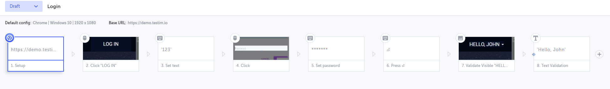

# testim-automation

WIP.

### Platform overview

What makes [Testim](https://testim.io) a unique platform is the ease of writing new tests. Two different ways are provided: via coding with a JavaScript API or through **recording your steps** while using the application. After creating the initial test, you can easily edit and implement validations conditions to guarantee that your software works as expected. 

### Creating your first test

After signing up and entering the `Editor` page, a new test is created. The first step is opening a default webpage configured for your project. For the effects of this test, I used the default [https://demo.testim.io](https://demo.testim.io) webpage, a sample app that can be used for testing Testim! 
There are plenty of options for customization to expand your tests, so go ahead and look around the Editor.



When you are ready to start, press the `Toggle Recording` button. This will open the defined webpage, and after a few moments, you can start using your application. When you are done, click the provided button to end the recording.



For my first test, I:

1. entered the [demo](https://demo.testim.io) webpage;
2. clicked the log in button;
3. typed `123` as my username (any user/password combo works in this sample app);
4. clicked the password input box;
5. typed a password;
6. pressed the Enter key.

This first test allowed me to test the app authentication page, which redirected me to a different page where the header contains a message to indicate the user is authenticated. The recorded steps were shown in a very user-friendly manner.



With the steps to authenticating made, we can validate if the webpage actually corresponds to what we expect after performing those steps. After logging in, a header message saying `Hello, John` substitutes the login button.
By hovering the arrow between the steps, you can include additional steps, like validation. You can validate if an element is visible or not if a particular text is present or even provide custom validations.

For the effects of this simple scenario, to check that `Hello, John` appears, I added steps after the authentication was done to verify if the element is visible and if the text is correct.
If you set breakpoints, you can run the test where you want to add the validations, which will open the webpage precisely where you want to test.



After inserting these steps, our test is done! A new browser window is opened by pressing `F8` or clicking the `Run test` button where each step is executed, and validation is made.
If everything went well, a `Test Completed Successfully` message should appear. More options for testing are available for complex tests, and more information can be found on the project dashboards.

## Running tests via CLI

Now that we have created a test, we can also execute them automatically.
Instead of going to the Testim web editor, opening every test, and running them manually, we can execute them via a command-line interface via scripts.

Testim CLI has only a few requirements to start using.

- Node.js, versions between 10 and 12.
  - versions 13+ are not currently supported.
  - I suggest using [NVM](https://github.com/nvm-sh/nvm) on Linux and [NVM for Windows](https://github.com/coreybutler/nvm-windows) on Windows to manage multiple installations of node.js. They make it a lot easier to handle installing and using specific versions.


```
npm install -g @testim/testim-cli
```
This will install the Testim provided a package that will be used. This tool communicates with Testim to execute your tests outside of their browser web environment.


```
testim --token "$TOKEN" --project "$PROJECT" --use-local-chrome-driver --user $USER
```

`$TOKEN`, `$PROJECT` and `$USER` are variables that can be obtained inside the platform by going to the `Settings > CLI` page.
Extra parameters are available. `--label` and `--suite` allow you to categorize and run a group of tests, while `--name` will enable you to run a specific test only.

More options to customize how the tests will run can be found on the [Command line interface (CLI)](https://help.testim.io/docs/the-command-line-cli) documentation page.


### Testing via CI/CD

Automating your tests is essential towards [CI/CD](https://en.wikipedia.org/wiki/CI/CD).
Via the usage of the CLI package, we can integrate it, so tests run automatically whenever new code changes are introduced towards the codebase.

An example of `.gitlab.yml` configuration for GitLab CI is provided below, using the ["Testim-Grid" grid](https://help.testim.io/docs/grid-management).

```
image: node:10.0.0
stages:
  - e2e
testim:
  stage: e2e
  image: docker:git
  variables:
    TESTIM_DOCKER: testim/docker-cli
  services:
    - docker:stable-dind
  script:
    - docker pull $TESTIM_DOCKER
    - docker run --rm -v "$(pwd)":/opt/testim-runner $TESTIM_DOCKER --token "$TOKEN" --project "$PROJECT" --grid "Testim-Grid"
```

## More information

Testim has very in-depth documentation, available at [https://help.testim.io/docs](https://help.testim.io/docs), so if you have any questions, try checking there first.


## Author

[Francisco Knebel](https://github.com/FranciscoKnebel)

## License

MIT License. [Click here for more information](LICENSE).
